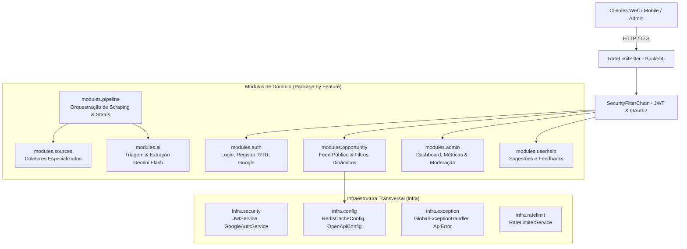
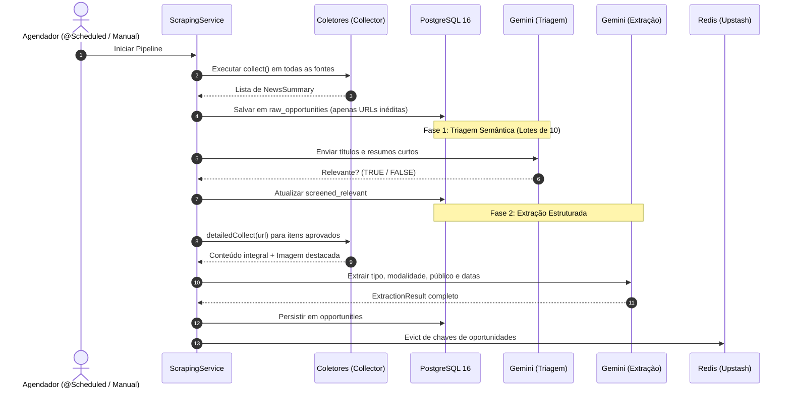

# Coralink API


<div align="center">

[](https://www.oracle.com/java/)
[](https://spring.io/projects/spring-boot)
[](https://spring.io/projects/spring-security)
[](https://www.postgresql.org/)
[](https://upstash.com/)
[](https://ai.google.dev/)
[](https://flywaydb.org/)

<p align="center">
  <strong>Aplicação inteligente de coleta, filtragem com IA e distribuição de oportunidades acadêmicas e profissionais para universitários e estudantes.</strong>
</p>

</div>

---

## 📑 Sumário

- [1. Visão Geral](#1-visão-geral)
- [2. Arquitetura do Sistema (Package by Feature)](#2-arquitetura-do-sistema-package-by-feature)
- [3. Pipeline de Scraping & Funil de IA em Duas Etapas](#3-pipeline-de-scraping--funil-de-ia-em-duas-etapas)
- [4. Segurança, Autenticação & Autorização](#4-segurança-autenticação--autorização)
- [5. Catálogo de Endpoints da API REST](#5-catálogo-de-endpoints-da-api-rest)
- [6. Como Contribuir Adicionando Novas Fontes (Guia de Pull Request)](#6-como-contribuir-adicionando-novas-fontes-guia-de-pull-request)
- [7. Configuração e Execução do Projeto](#7-configuração-e-execução-do-projeto)
- [8. Testes Automatizados & Qualidade](#8-testes-automatizados--qualidade)
- [9. Licença](#9-licença)

---

## 1. Visão Geral

O **Coralink API** é um serviço back-end construído em **Java 21** e **Spring Boot**, com o objetivo de resolver a fragmentação de oportunidades acadêmicas, editais, estágios, bolsas de pesquisa, cursos e eventos de tecnologia na Região Metropolitana do Recife (RMR) e polos educacionais.

O sistema:
1. **Monitora continuamente portais e centros de referência** (CIn-UFPE, UFPE, IFPE, UPE, Porto Digital, CESAR School, UNIBRA, UNIFAFIRE, Facepe, Senac-PE, Sympla).
2. **Ingere e deduplica publicações brutas** em tempo real.
3. **Executa um funil de enriquecimento via Inteligência Artificial** (Google Gemini Flash via Spring AI) composto por:
   - **Fase 1 (Triagem):** Classificação semântica binária de relevância prática para universitários.
   - **Fase 2 (Extração Estruturada):** Extração de prazos, modalidade, público-alvo, gratuidade e links diretos.
4. **Armazena e indexa com alta performance** no PostgreSQL e distribui via cache **Upstash Redis (TLS)** com Jackson 3.
5. **Garante segurança robusta** com login local (BCrypt), Google OAuth2, rotação contínua de Refresh Token (RTR) e controle de acesso estrito (RBAC).

---

## 2. Arquitetura do Sistema (Package by Feature)

A aplicação segue o padrão **Package by Feature (Vertical Slices)**, segregando o domínio por capacidades de negócio e isolando os componentes transversais sob o pacote `infra`:



### Estrutura de Diretórios
```text
io.github.lucasfcz.coralink/
│
├── CoralinkApplication.java               # Inicializador Spring Boot
│
├── infra/                                 # Componentes Transversais Compartilhados
│   ├── config/                           # Cache Redis (Jackson 3 / Lettuce SSL) e OpenAPI Swagger 3
│   ├── exception/                        # @RestControllerAdvice e ApiError padronizado
│   ├── ratelimit/                        # Rate limiting Bucket4j por IP / Token
│   └── security/                         # SecurityFilterChain, JwtService, GoogleAuthService, RTR
│
└── modules/                               # Módulos Autônomos de Negócio
    ├── auth/                             # Autenticação, Usuários, Refresh Tokens e Roles
    ├── opportunity/                      # Feed de oportunidades, JPA Specifications e Projeções
    ├── admin/                            # Painel administrativo, Métricas de funil e Moderação
    ├── pipeline/                         # Esteira agendada de scraping, deduplicação e auditoria
    ├── ai/                               # Integração com Google Gemini (Triagem + Extração)
    ├── sources/                          # Coletores plugáveis de universidades e instituições
    └── userhelp/                         # Sistema de sugestões e suporte da comunidade
```

---

## 3. Pipeline de Scraping & Funil de IA em Duas Etapas

Para otimizar custos de computação e tokens do LLM, o Coralink implementa um **funil de processamento em 2 estágios**:



---

## 4. Segurança, Autenticação & Autorização

O Coralink adota **Defesa em Profundidade** (*Defense in Depth*):

* **Autenticação Dupla:**
  - **Login Local:** E-mail e senha com hash seguro `BCrypt`.
  - **Google OAuth2:** Verificação criptográfica de Google ID Tokens via `GoogleIdTokenVerifier`, checando assinaturas, emissores, expiração e status de verificação da conta Google.
* **Refresh Token Rotation (RTR):**
  - Access Token stateless de curta duração (15 minutos).
  - Refresh Tokens opacos armazenados em formato criptográfico SHA-256 no banco.
  - A cada renovação, o refresh token anterior é revogado e um novo par é emitido.
  - **Detecção de Reuso:** Se um refresh token já consumido for reutilizado, o sistema assume vazamento de sessão e revoga preventivamente **toda a família de tokens** daquele usuário.
* **Cookies Seguros:** Refresh tokens trafegam exclusivamente via cookie `HttpOnly`, com `SameSite=Lax`, blindados contra ataques XSS.
* **Rate Limiting:** Proteção contra ataques de força bruta com `Bucket4j` (20 requisições/minuto por IP com leitura confiável de `X-Forwarded-For`).
* **Isolamento de Papéis (RBAC):**
  - `ROLE_USER`: Acesso a feeds públicos, detalhes e submissão de sugestões.
  - `ROLE_ADMIN`: Acesso restrito a `/admin/**` (estatísticas, métricas da esteira, trigger manual, inspeção de lotes e edição/soft-delete de oportunidades).
* **Resiliência e Tolerância a Falhas no Cache:**
  - Implementação de `CacheErrorHandler` customizado via `CachingConfigurer`. Em cenários de indisponibilidade, timeout ou erro de desserialização no Upstash Redis, a API executa um fallback transparente para o PostgreSQL sem interromper as requisições dos usuários.

---

## 5. Catálogo de Endpoints da API REST

A documentação interativa completa (OpenAPI 3.0 / Swagger UI) está disponível em:
👉 `http://localhost:8080/swagger-ui/index.html`

### 🔑 Autenticação (`/auth`)
| Método | Endpoint | Descrição | Acesso |
| :--- | :--- | :--- | :--- |
| `POST` | `/auth/register` | Cadastro de usuário local (e-mail + senha com BCrypt) | Público |
| `POST` | `/auth/login` | Autenticação local gerando Access Token e Refresh Token | Público |
| `POST` | `/auth/google` | Login social com Google ID Token | Público |
| `POST` | `/auth/refresh` | Rotação e renovação do Access Token via Refresh Token | Público (Cookie) |
| `POST` | `/auth/logout` | Revogação de sessão e limpeza de cookies | Público |
| `GET` | `/auth/me` | Dados do usuário autenticado e suas permissões | Autenticado |

### 🎓 Oportunidades (`/opportunities`)
| Método | Endpoint | Descrição | Acesso |
| :--- | :--- | :--- | :--- |
| `GET` | `/opportunities` | Listagem paginada com filtros (`type`, `modality`, `isFree`, `targetCourseAudiences`) | Público (Cacheado) |
| `GET` | `/opportunities/quantity`| Contagem total de oportunidades vigentes | Público (Cacheado) |
| `GET` | `/opportunities/search` | Busca de oportunidades por termo no título ou descrição | Público (Cacheado) |
| `GET` | `/opportunities/{id}` | Detalhes completos de uma oportunidade pelo ID | Público (Cacheado) |

### 🛠️ Painel Administrativo (`/admin`)
| Método | Endpoint | Descrição | Acesso |
| :--- | :--- | :--- | :--- |
| `GET` | `/admin/dashboard/metrics` | Métricas de conversão da esteira, funil de IA e contagem de falhas | `ROLE_ADMIN` |
| `GET` | `/admin/pipeline/status` | Status em tempo real da esteira e tempo para próxima execução | `ROLE_ADMIN` |
| `POST` | `/admin/pipeline/trigger` | Disparo manual síncrono da pipeline de coleta | `ROLE_ADMIN` |
| `GET` | `/admin/pipeline/runs` | Histórico paginado de execuções da esteira | `ROLE_ADMIN` |
| `GET` | `/admin/pipeline/runs/{id}/items` | Inspeção detalhada dos itens brutos coletados em uma execução | `ROLE_ADMIN` |
| `GET` | `/admin/pipeline/failed-extractions` | Consulta paginada de oportunidades com falhas persistentes de IA | `ROLE_ADMIN` |
| `PUT` | `/admin/opportunities/{id}`| Correção manual de dados cadastrais e expiração | `ROLE_ADMIN` |
| `DELETE`| `/admin/opportunities/{id}`| Soft delete de oportunidade (expiração retroativa para ontem) | `ROLE_ADMIN` |

### 💡 Ajuda & Sugestões (`/suggestion`)
| Método | Endpoint | Descrição | Acesso |
| :--- | :--- | :--- | :--- |
| `POST` | `/suggestion/create` | Registro de sugestão de nova funcionalidade ou feedback | Público |
| `GET` | `/suggestion` | Consulta paginada de sugestões recebidas | `ROLE_ADMIN` |

---

## 6. Como Contribuir Adicionando Novas Fontes (Guia de Pull Request)

> [!TIP]
> **Arquitetura 100% Desacoplada:**  
> O Coralink adota o Princípio Aberto/Fechado (OCP). Adicionar uma nova fonte **não exige alterar nenhuma classe existente do sistema**.

### Passo 1: Leia o pacote collector em `io.github.lucasfcz.coralink.modules.sources.collector`
Entenda como funciona as classes abstratas e como podem ser adpatadas para criar uma nova fonte.

### Passo 2: Crie o Coletor
Crie uma nova classe no pacote `io.github.lucasfcz.coralink.modules.sources` implementando a interface `WordPressCollector` / `HtmlCollector` (você precisará identificar se a sua fonte possui Wordpress primeiro caso não tenha use o HtmlCollector):

```java
package io.github.lucasfcz.coralink.modules.sources;

import io.github.lucasfcz.coralink.modules.sources.collector.Collector;
import io.github.lucasfcz.coralink.modules.sources.dto.DetailedContent;
import io.github.lucasfcz.coralink.modules.sources.dto.NewsSummary;
import org.jsoup.Jsoup;
import org.jsoup.nodes.Document;
import org.jsoup.nodes.Element;
import org.springframework.stereotype.Component;

import java.io.IOException;
import java.time.LocalDateTime;
import java.util.ArrayList;
import java.util.List;

@Component
public class MinhaInstituicaoCollector implements HtmlCollector {

    private static final String BASE_URL = "https://minhainstituicao.edu.br/noticias";
    private static final String FALLBACK_IMAGE = "https://minhainstituicao.edu.br/logo.png";

    @Override
    public String sourceName() {
        return "MINHA_INSTITUICAO"; // Identificador único em String
    }

       // Adapte o codigo para coletar a fonte em questão caso nescessário
    @Override
    public List<NewsSummary> collect() {
        List<NewsSummary> list = new ArrayList<>();
        try {
            Document doc = Jsoup.connect(BASE_URL).timeout(10000).get();
            for (Element item : doc.select("article.noticia")) {
                String title = item.select("h2.title").text();
                String url = item.select("a").attr("href");
                String summary = item.select("p.resumo").text();

                list.add(new NewsSummary(title, summary, url, sourceName(), LocalDateTime.now()));
            }
        } catch (IOException e) {
            // Trate falhas de conectividade pontuais sem interromper o serviço
        }
        return list;
    }

        // Este método é referente a página dedicada da oportunidade
        //  onde também pode ser preciso fazer adaptações
    @Override
    public DetailedContent detailedCollect(String newsUrl) {
        try {
            Document doc = Jsoup.connect(newsUrl).timeout(10000).get();
            String fullText = doc.select("div.noticia-conteudo").text();
            String imageUrl = doc.select("div.banner img").attr("src");
            return new DetailedContent(fullText, imageUrl.isBlank() ? FALLBACK_IMAGE : imageUrl);
        } catch (IOException e) {
            return new DetailedContent("", FALLBACK_IMAGE);
        }
    }

    @Override
    public String fallbackImageUrl() {
        return FALLBACK_IMAGE;
    }
}
```

### Passo 2: Crie o Teste Unitário do seu Coletor
Crie o teste em `src/test/java/io/github/lucasfcz/coralink/modules/sources/MinhaInstituicaoCollectorTest.java`:

```java
package io.github.lucasfcz.coralink.modules.sources;

import io.github.lucasfcz.coralink.modules.sources.dto.NewsSummary;
import org.junit.jupiter.api.Test;
import java.util.List;
import static org.junit.jupiter.api.Assertions.*;

class MinhaInstituicaoCollectorTest {

    private final MinhaInstituicaoCollector collector = new MinhaInstituicaoCollector();

    @Test
    void testCollectReturnsData() {
        assertEquals("MINHA_INSTITUICAO", collector.sourceName());
        List<NewsSummary> summaries = collector.collect();
        assertNotNull(summaries);
        // Validar integridade dos resumos coletados
    }
}
```

### Passo 3: Valide Localmente
Execute o comando Maven para garantir que seu coletor e a suíte completa passem com sucesso:
```bash
./mvnw test -Dtest=MinhaInstituicaoCollectorTest
./mvnw test
```

### Passo 4: Abra o Pull Request
1. Faça o fork do repositório.
2. Crie uma branch para sua fonte: `git checkout -b feature/fonte-minha-instituicao`.
3. Faça commit e push das alterações.
4. Abra um **Pull Request** apontando para a branch `codex/development`.
5. Nossa equipe técnica avaliará o coletor, validará a estabilidade da URL e aprovará a integração!

---

## 7. Configuração e Execução do Projeto

### Pré-requisitos
* **Java 21** (JDK 21 instalado e configurado no `PATH`).
* **Docker & Docker Compose** (para PostgreSQL e Redis local).
* **Chave de API do Google Gemini** (obtenha gratuitamente no [Google AI Studio](https://aistudio.google.com/)).

### 7.1 Configurando Variáveis de Ambiente
Copie o modelo de ambiente e defina seus segredos:
```bash
cp .env.example .env
```

Edite o arquivo `.env`:
```env
SPRING_PROFILES_ACTIVE=dev
JWT_SECRET=sua_chave_secreta_jwt_de_pelo_menos_256_bits_aqui
GEMINI_API_KEY=sua_chave_gemini_aqui
DB_URL=jdbc:postgresql://localhost:5432/coralink
DB_USERNAME=coralink
DB_PASSWORD=coralink
```

### 7.2 Execução com Docker Compose
Para subir o banco de dados PostgreSQL e Redis localmente:
```bash
docker compose up -d
```

### 7.3 Execução da Aplicação Spring Boot
```bash
./mvnw spring-boot:run
```

A API estará pronta para receber requisições em: `http://localhost:8080`

---

## 8. Testes Automatizados & Qualidade

A aplicação conta com uma rigorosa suíte de testes cobrindo testes unitários, validação de tokens JWT, testes de segurança MockMvc, desserialização de cache Redis e testes de coletores:

```bash
# Executar toda a suíte de testes
./mvnw clean test
```

Status atual: **97 testes executados, 0 falhas, 0 erros.**

---

## 9. Licença

Este projeto é disponibilizado sob a licença [MIT](LICENSE). Sinta-se livre para utilizar, colaborar e evoluir a plataforma.